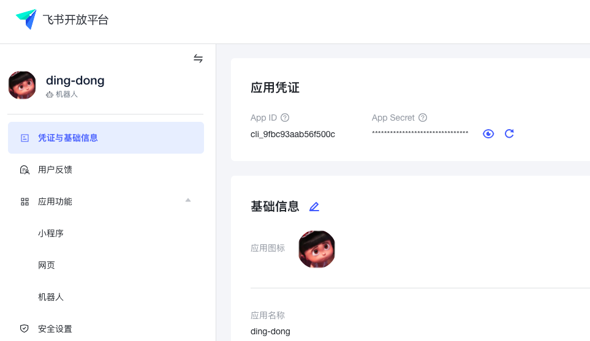
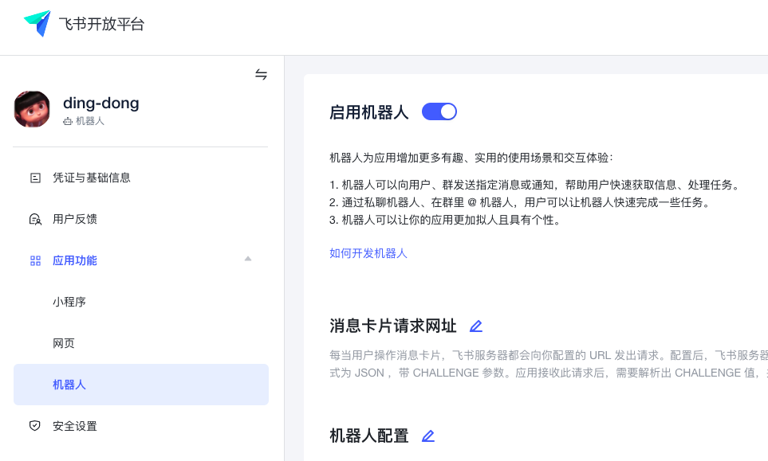
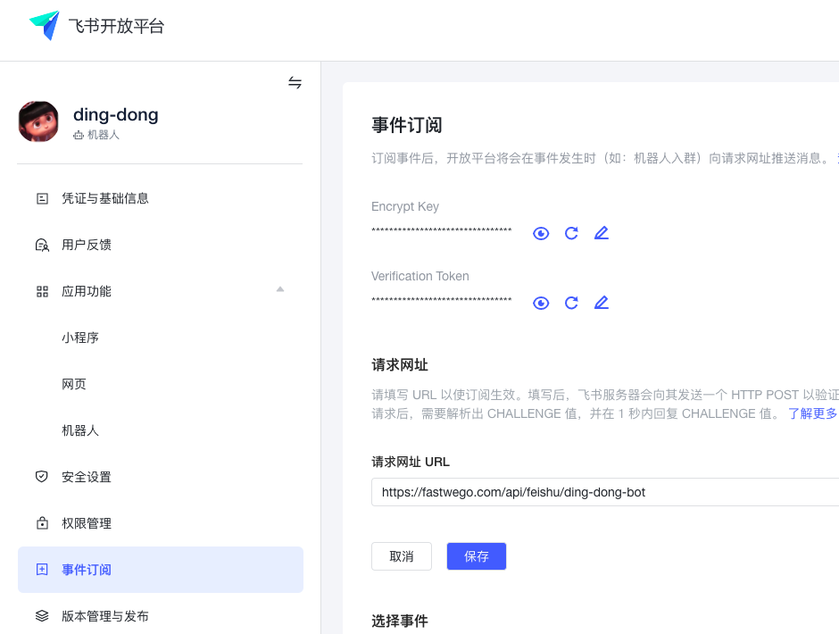
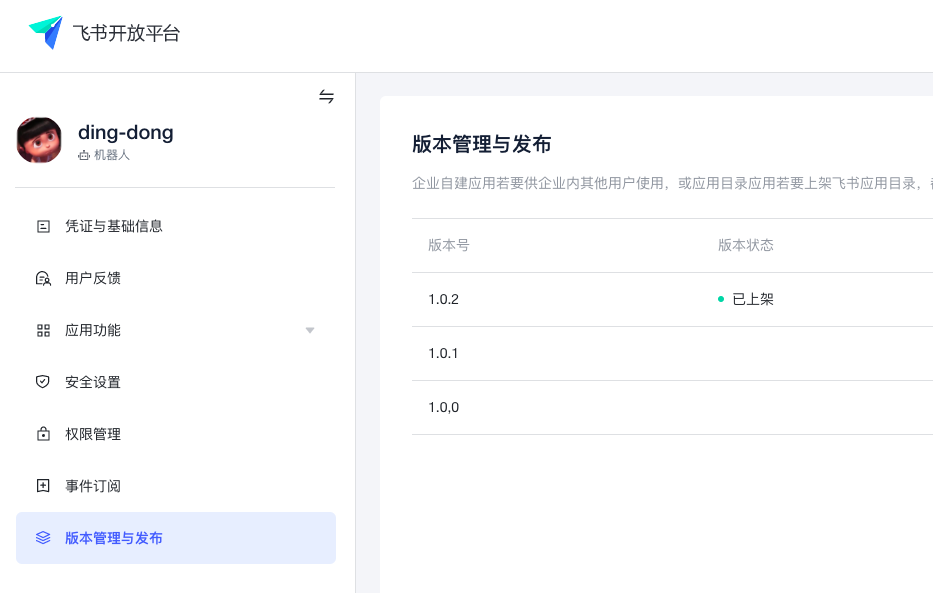

# 如何在飞书平台上 5 分钟内打造一个叮咚机器人

## 在飞书注册一个机器人应用

- 配置名称、图标等基本信息,获取应用的 appid/appsecret


- 启动机器人功能


- 配置机器人 回调 url ，获取 EncryptKey 和 Token

注意：此时需要校验 url 有效，请看代码部分



- 发布应用


## 安装 fastwego/feishu 开发 sdk

`go get -u github.com/fastwego/feishu`

## 开发机器人

### 配置

- 将飞书应用的配置更新到 `.env` 文件：
```.env

AppId=xxx
AppSecret=xxx
VerificationToken=xxx
EncryptKey=xxx

LISTEN=:80
```

- 编写代码：

```go
package main

import (
	"context"
	"encoding/json"
	"fmt"
	"log"
	"net/http"
	"os"
	"os/signal"
	"syscall"
	"time"

	"github.com/fastwego/feishu/apis/message"
	"github.com/fastwego/feishu/types/event_types"

	"github.com/fastwego/feishu"

	"github.com/spf13/viper"

	"github.com/gin-gonic/gin"
)

var App *feishu.App

func init() {
	// 加载配置文件
	viper.SetConfigFile(".env")
	_ = viper.ReadInConfig()

	// 创建应用实例
	App = feishu.NewApp(feishu.AppConfig{
		AppId:             viper.GetString("AppId"),
		AppSecret:         viper.GetString("AppSecret"),
		VerificationToken: viper.GetString("VerificationToken"),
		EncryptKey:        viper.GetString("EncryptKey"),
	})

}

func main() {

	router := gin.New()
	router.Use(gin.Logger(), gin.Recovery())

	// 接收 飞书 事件 回调
	router.POST("/api/feishu/ding-dong-bot", DingDongBot)

	svr := &http.Server{
		Addr:    viper.GetString("LISTEN"),
		Handler: router,
	}

	go func() {
		err := svr.ListenAndServe()
		if err != nil && err != http.ErrServerClosed {
			log.Fatalln(err)
		}
	}()

	quit := make(chan os.Signal)
	signal.Notify(quit, syscall.SIGINT, syscall.SIGTERM)
	<-quit

	timeout := time.Duration(5) * time.Second
	ctx, cancel := context.WithTimeout(context.Background(), timeout)
	defer cancel()

	if err := svr.Shutdown(ctx); err != nil {
		log.Fatalln(err)
	}
}

// 机器人响应
func DingDongBot(c *gin.Context) {

	event, err := App.Server.ParseEvent(c.Request)
	if err != nil {
		return
	}

	switch event.(type) {
	case event_types.EventChallenge: // url 校验
		App.Server.Challenge(c.Writer, event.(event_types.EventChallenge))
	case event_types.EventMessageText:
		userMsg := event.(event_types.EventMessageText)
		fmt.Println(userMsg)

		replyTextMsg := struct {
			OpenId  string `json:"open_id"`
			MsgType string `json:"msg_type"`
			Content struct {
				Text string `json:"text"`
			} `json:"content"`
		}{
			OpenId:  userMsg.Event.OpenID,
			MsgType: "text",
			Content: struct {
				Text string `json:"text"`
			}{Text: "dong"},
		}

		data, err := json.Marshal(replyTextMsg)
		if err != nil {
			fmt.Println(err)
			return
		}

		resp, err := message.Send(App, data)
		fmt.Println(string(resp), err)
	}
}

```

## 编译 & 部署 到服务器

`GOOS=linux go build`

`chmod +x ./ding-dong-bot && ./ding-dong-bot`

## 测试发送消息

应用发布后，可以在工作台看到入口


给机器人发送消息，机器人就会回复 `dong`


## 结语

恭喜你！5分钟内就完成了一款飞书机器人开发

完整演示代码：[https://github.com/fastwego/feishu-demo](https://github.com/fastwego/feishu-demo)