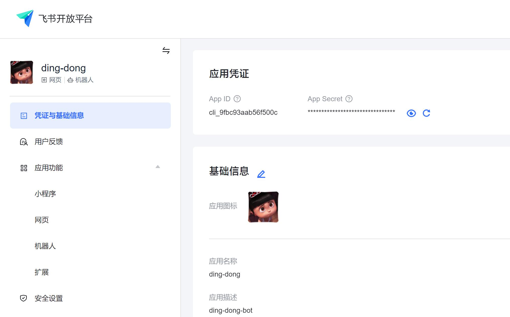
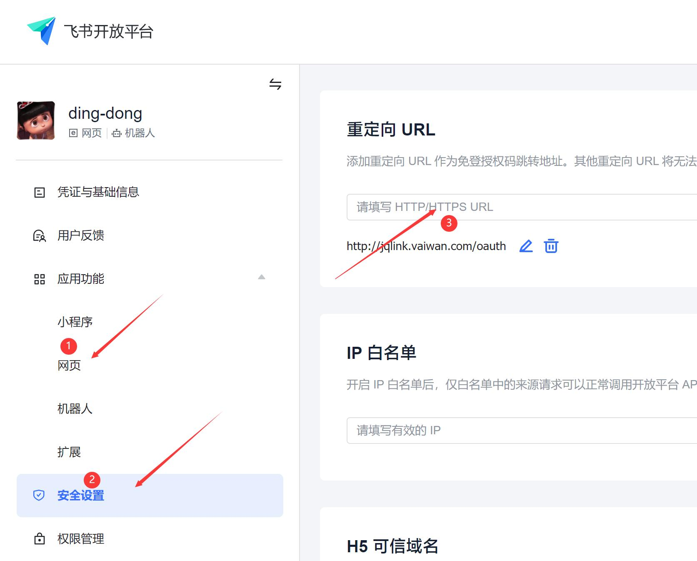
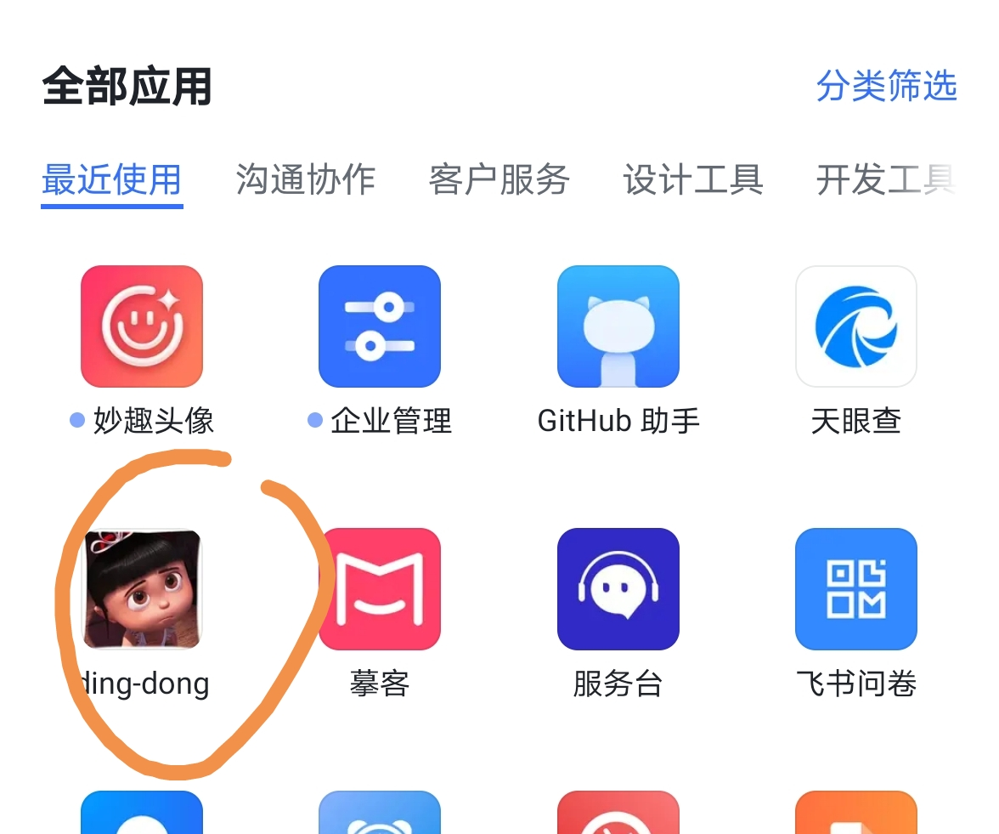
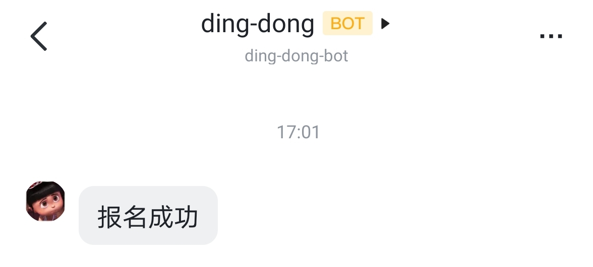

# 如何用 5 分钟在飞书上搭建一款活动报名 App 

## 需求

公司内部活动报名，需要员工登录 & 发送报名通知

## 技术原理

飞书提供了 获取 员工信息 接口 和 发送消息 接口

所以，我们只需开发一个服务，员工完成登录后 记录 session，报名成功后 发送消息 即可

## 配置飞书内部应用

- 设置工作台应用主页

- 启用网页功能 & 配置重定向 URL

- 可以在工作台看到入口

- 进入主页后点击登录，可以获取员工信息

- 点击报名后，可以收到通知

## 主要代码：

[main.go](./main.go)

## 结语

恭喜你！5分钟内就完成了一款企业内部 App 开发

完整演示代码：[https://github.com/fastwego/feishu-demo](https://github.com/fastwego/feishu-demo)